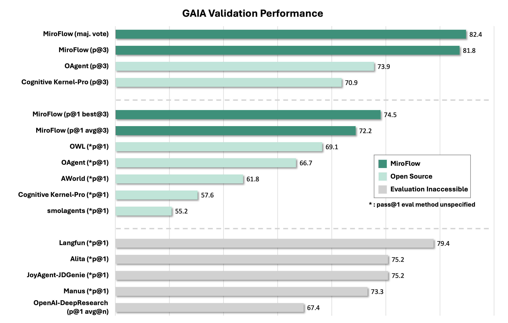
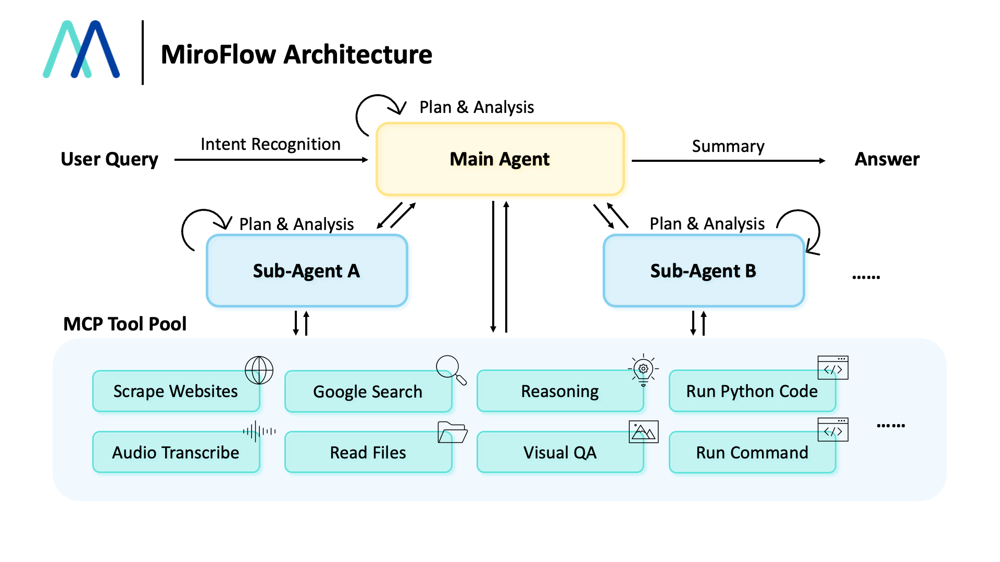

<div align="center">
  
</div>

<div align="center">

[](https://dr.miromind.ai/)
[](https://huggingface.co/collections/miromind-ai/mirothinker-v01-689301b6d0563321862d44a1)
[](https://huggingface.co/datasets/miromind-ai/MiroVerse-v0.1)
[](https://github.com/MiroMindAI)
[](https://miromind.ai/)

[](https://discord.com/invite/GPqEnkzQZd)
[](https://cdn-uploads.huggingface.co/production/uploads/68525b342230a897a65cc1c0/SGK70isvVpeJwk_fny9sb.png)
[](https://www.xiaohongshu.com/user/profile/663098830000000003033edc)
[](https://deepwiki.com/MiroMindAI/MiroFlow)


</div>

## 📰 News & Updates

- **2025-08-26**: 🎉 **New Open-Source SOTA Results** - MiroFlow has achieved state-of-the-art or highly competitive performance across multiple agentic benchmarks: **HLE 27.2%**, **HLE-Text-Only 29.5%**, **BrowserComp-EN 33.2%**, **BrowserComp-ZH 44.3%**, and **xBench-DeepSearch 72.0%**. For comprehensive analysis and detailed results, please see our [Blog](https://miromind.ai/blog/miroflow).
- **2025-08-25**: 🎉 **GAIA-Validation Trace Release** - We have released comprehensive MiroFlow execution traces achieving an overall accuracy of 73.94% (Pass@1) on the GAIA validation benchmark. This represents the best reproducible result we are aware of to date. Explore the traces at [Trace-GAIA-Validation](apps/public-trace/gaia-validation).
- **2025-08-22**: 🎉 **Light-Weight Deployment** - Introducing streamlined deployment options for MiroThinker models with optimized resource usage and faster startup times. Experience the interactive demo: [🚀 Try Gradio Demo](https://github.com/MiroMindAI/MiroThinker/tree/main/apps/gradio-demo)
- **2025-08-08**: 🎉 **MiroFlow v0.1 Released** - Framework, model, and data are now fully open-sourced!


<div align="center">
  
  <a href="https://star-history.com/#MiroMindAI/MiroFlow&Date">
    
  </a>
</div>


## 📝 Introduction


**MiroFlow** is a fully open-sourced agent framework that reliably completes complex tool-use tasks. Some key features are:

- 🌟 **Reproducible SOTA**: **MiroFlow** consistently achieves 72.2% (pass@1 average@3) on GAIA validation set. Follow our [getting-started guide](#get-start) below, or view our many runs of gaia trace on huggingfaces. If you can't reproduce our result, please open a Github issue - We take reproducibility seriously.
- 🌟 **High-quanlity Data Collection**: We enabled the agent workflow with data colleciton features to generate high-quality, post-training agent trace data. We also released partial data and model to public including [MiroThinker](https://huggingface.co/collections/miromind-ai/mirothinker-v01-689301b6d0563321862d44a1) and [MiroVerse](https://huggingface.co/datasets/miromind-ai/MiroVerse-v0.1).
- 🌟 **High Concurrency and Fault Tolerance**: **MiroFlow**  scales data collection efficiently and handles rate-limited APIs and unstable network connections with ease.
- 🌟 **Baked-in observability and evaluation**: **MiroFlow** ships with scripts for benchmarking agents and a straightforward web-ui for visualizing and debugging agent trace data.


## ✨ Performance on Benchmarks

<div align="center">
  
</div>

We benchmark MiroFlow on a series of benchmarks including **GAIA**, **HLE**, **BrowseComp** and **xBench-DeepSearch**. Meantime, we are working on more benchmarks.

| Model/Framework | GAIA Val | HLE | HLE-Text | BrowserComp-EN | BrowserComp-ZH | xBench-DeepSearch |
|----------------|----------|-----|----------|----------------|----------------|-------------------|
| **MiroFlow** | **82.4%** | **27.2%** | 29.5% | **33.2%** | **44.3%** | **72.0%** |
| OpenAI Deep Research | 67.4% | 26.6% | - | **51.5%** | 42.9% | - |
| Gemini Deep Research | - | 26.9% | - | - | - | 50+% |
| Kimi Researcher | - | - | 26.9% | - | - | 69.0% |
| WebSailor-72B | 55.4% | - | - | - | 30.1% | 55.0% |
| Manus | 73.3% | - | - | - | - | - |


### GAIA-Validation



MiroFlow **achieved 81.8% pass@3, 82.4% maj. vote, 74.5% pass@1 (best@3), and 72.2% pass@1 (avg@3) on the GAIA validation set**. This represents **state-of-the-art (SOTA) performance** among open-source agent frameworks.

> [!NOTE]
> Our pass@1 scores are reported as both the average across three runs (avg@3) and the best score among those runs (best@3). For most other reported pass@1 results, it is unclear whether they represent an average or a best score across multiple trials (indicated with *). 

To prevent agents from retrieving answers directly from Hugging Face, we disabled access to it during the inference and trace collection.

*We have evaluated multiple agent frameworks on GAIA. Please note that some reported results may be overstated or lack clear definitions, and are not reproducible.*
In contrast, reproducing MiroFlow's results is straightforward with just a few required API keys.


## 📚 Table of Contents

- [🤖 MiroFlow: Modular AI Agent Framework](#-miroflow-modular-ai-agent-framework)
  - [Workflow Overview](#workflow-overview)
  - [Architecture Components](#architecture-components)
    - [Core System 💻](#core-system-)
    - [Tool Integration 🔧](#tool-integration-)
    - [Agent System 👷](#agent-system-)
    - [Support Systems ⚙️](#support-systems-️)
- [🚀 Getting Started](#-getting-started)
  - [Prerequisites](#prerequisites)
  - [Runing a single task](#runing-a-single-task)
  - [Evaluate on Benchmark](#evaluate-on-benchmark)
  - [[Optional] Customized Configuration](#optional-customized-configuration)
- [🌟 MiroThinker](#-mirothinker)
- [❓ FAQ](#-faq)


# 🤖 MiroFlow: Modular AI Agent Framework

MiroFlow is a sophisticated, modular framework for building intelligent AI agents with multi-turn conversation capabilities, comprehensive tool integration, and hierarchical sub-agent support.

<div align="center">

</div>

More information on our agent [workflow](docs/workflow.md).


<a id="get-start"></a>
# 🚀 Getting Started

## Prerequisites
> [!TIP]
> we recommend using [`uv`](https://docs.astral.sh/uv/) with `python>= 3.12` 

**Step 1:** Clone repo and prepare python environment:

```bash
## clone the repo
git clone https://github.com/MiroMindAI/MiroFlow
cd MiroFlow/apps/run-agent

## prepare python environment
uv sync
```

**Step 2:** Set up environment dependencies:

a. Set up `MiroFlow/apps/prepare-benchmark/.env` by:
```bash
## copy environment variable template and prepare yours in .env file
cd MiroFlow/apps/prepare-benchmark

# Edit .env with your actual API keys
cp .env.template .env
```
Edit `.env` to configure environment variables:  
```
# For downloading datasets from Hugging Face
HF_TOKEN="<your-huggingface-token>"

# [Optional] Data loading directory, by default `../../data`
DATA_DIR="../../data" # relative to this file 
```

b. Set up `MiroFlow/apps/run-agent/.env` by:
```bash
## copy environment variable template and prepare yours in .env file
cd MiroFlow/apps/run-agent

# Edit .env with your actual API keys
cp .env.template .env
```
Edit `.env` to configure environment variables:  
```
# Using OpenRouter to provide primary agent model
OPENROUTER_API_KEY=""
OPENROUTER_BASE_URL="https://openrouter.ai/api/v1"

# Anthropic, for vision tools
ANTHROPIC_API_KEY=""
ANTHROPIC_BASE_URL="https://api.anthropic.com"

# OpenAI, for audio tools, intent recognition, and answer extraction
OPENAI_API_KEY=""
OPENAI_BASE_URL="https://api.openai.com/v1"

# Gemini, for YouTube tasks
GEMINI_API_KEY=""

# Third party API keys
# For Google search and website scraping
SERPER_API_KEY=""
# For website scraping
JINA_API_KEY=""
# For the Linux sandbox
E2B_API_KEY=""

# [Optional] NewAPI, alternative to OpenRouter 
NEWAPI_API_KEY=""
NEWAPI_BASE_URL=""

# [Optional] for network proxy, null by default
HTTPS_PROXY=""
# [Optional] Data loading directory, by default `../../data`
DATA_DIR="../../data"
```

If you wish to use a different LLM as the primary agent model, you will need to provide the corresponding API keys.


**Step 3:** Prepare E2B Sandbox (Optional)

> [!TIP]
> We provide a public E2B sandbox template. Follow this step if you want to reproduce.
>
> For the E2B sandbox service, we recommend setting up a Linux Docker image with a comprehensive set of apt and Python packages pre-installed. Without these pre-installed packages, the agent will need to spend extra steps and context installing them, resulting in reduced token efficiency.
>
> you need to have `npm` install and `docker` running locally.


1. Install `e2b` command line and login:

```shell
## install e2b
npm install -g @e2b/cli
## check that it is available
which e2b 
```

2. Download our pre-configured Dockerfile:
[e2b.Dockerfile](https://github.com/MiroMindAI/MiroFlow/blob/main/docs/e2b.Dockerfile).

```shell
wget https://github.com/MiroMindAI/MiroFlow/blob/main/docs/e2b.Dockerfile
```

3. Run `e2b template build` command [check official doc here](https://e2b.dev/docs/sdk-reference/cli/v1.0.2/template), use `all_pip_apt_pkg` as the name of template.

```shell
## build the template with `docker build` locally
E2B_ACCESS_TOKEN=${your-token}
e2b template build -c "/root/.jupyter/start-up.sh" -n "all_pip_apt_pkg" -d ./e2b.Dockerfile
## check that template is built successfully
E2B_ACCESS_TOKEN=${your-token} e2b template list
```

For additional information, please see the [E2B Docker documentation](https://e2b.dev/docs/sandbox-template).


## Runing a single task

Run a single task:

```bash
## run a task with instruction
cd MiroFlow/apps/run-agent
uv run main.py trace --task="your task description" --task_file_name="path to related task file"
```

## Evaluate on Benchmark

Run prebuilt agent on the benchmark data:

```bash
## download data
cd MiroFlow/apps/prepare-benchmark
uv run main.py get gaia-val
## run the code
cd MiroFlow/apps/run-agent
uv run main.py common-benchmark benchmark=gaia-validation
```

To perform parallel multi-run evaluations, you can use the provided script:

```bash
cd MiroFlow/apps/run-agent
bash scripts/claude-sonnet-3.7/run_evaluate_multiple_runs_gaia-validation.sh
```


## [Optional] Customized Configuration

MiroFlow uses [Hydra](https://hydra.cc/) for flexible configuration management, enabling seamless switching between different LLMs, agents, benchmarks, and pricing models through YAML configuration files.


# 🌟 MiroThinker

[MiroThinker](https://github.com/MiroMindAI/MiroThinker) (7B/14B/32B) is our suite of open-source agentic models, designed to work seamlessly with the MiroFlow framework. Our models are specifically built to handle **complex, multi-tool tasks**, leveraging the reproducible and robust foundation that MiroFlow provides.

By combining MiroFlow’s reliable orchestration with MiroThinker’s advanced reasoning capabilities, we offer a powerful, end-to-end solution for building high-performing, reproducible AI agents.
These models are a direct result of our extensive data collection efforts, utilizing MiroFlow to generate high-quality, post-training agent trace data. This unique approach enables MiroThinker to excel in planning, executing, and reasoning through complex multi-step tasks.
We invite the community to explore and build upon these models. For more details on the architecture and implementation, please take a look at our codebase.

# 🔧 FAQ

**Q: What is the estimated cost of running the GAIA validation set for a single run?** <br>
**A**: The cost is approximately **$450 USD** for a run without a cache. Enabling the cache can significantly reduce this cost by 50-67%, bringing it down to the **$150 - $225** range.


**Q: How long does it take to run the GAIA validation set for a single run?** <br>
**A**: With the `max_concurrent` parameter set to 20, a full run takes about **5 hours** to complete.

**Q: Are all the specified APIs required?** <br>
**A**: **Yes.** To fully reproduce our published results, access to all the listed APIs is necessary.


**Q: What is the difference between MiroFlow and MiroThinker?** <br>
**A**:  **MiroFlow** is primarily focused on interacting with proprietary models; **MiroThinker** is designed for our own open-source models.

We plan to merge these two projects in the future to create a single, unified platform.

### References

```
@misc{2025mirothinker,
    title={MiroFlow: An Open-Source Agentic Framework for Deep Research},
    author={MiroMind AI Team},
    howpublished={\url{https://github.com/MiroMindAI/MiroFlow}},
    year={2025}
}
```
