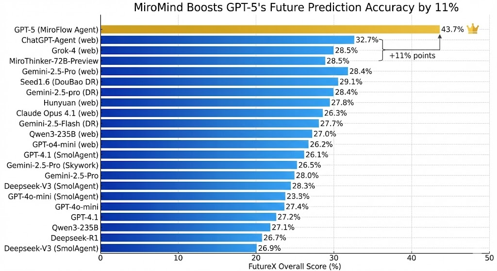

<div align="center">
  

  <h3>Open-Source Research Agent Framework with State-of-the-Art Performance</h3>

[](https://dr.miromind.ai/)
[](https://huggingface.co/miromind-ai)
[](https://miromindai.github.io/miroflow/)
[](https://miromind.ai)
[](https://discord.com/invite/GPqEnkzQZd)
[](https://www.xiaohongshu.com/user/profile/663098830000000003033edc)

</div>

<div align="center">
<strong>MiroFlow</strong> is an open-source research agent framework that achieves <strong>#1 ranking</strong> across representative benchmarks (FutureX, GAIA, HLE, xBench-DeepSearch, BrowseComp).<br>
It powers <a href="https://github.com/MiroMindAI/mirothinker">MiroThinker</a>, our open-source agent foundation model with native tool-assisted reasoning.
</div>

<br>

<div align="center">
  
</div>

---

## 📰 News

- **[2026-03]**: **MiroFlow 1.6 + MiroThinker 1.6**: Major release with Web Application interface (FastAPI + React), comprehensive verifier system for benchmark evaluation, and expanded LLM support including Kimi K2.5 and GPT-5.

<details>
<summary><strong>Previous Updates</strong></summary>

- **[2025-09-15]**: **MiroFlow v0.3**: Enhanced codebase architecture and significantly improved benchmark performance, boosting GPT-5's prediction accuracy for future events by 11%. MiroFlow now ranks #1 in the future prediction benchmark. See [FutureX](https://futurex-ai.github.io/).
- **[2025-08-27]**: **MiroFlow v0.2**: Achieves state-of-the-art performance across [multiple agentic benchmarks](https://miromind.ai), including HLE (27.2%), HLE-Text-Only (29.5%), BrowserComp-EN (33.2%), BrowserComp-ZH (47.1%), and xBench-DeepSearch (72.0%).
- **[2025-08-26]**: Released [GAIA Validation Trace](docs/public_trace.md) (73.94% pass@1) and [Gradio Demo](https://github.com/MiroMindAI/MiroThinker/tree/main/apps/gradio-demo) for local deployment.
- **[2025-08-08]**: **MiroFlow v0.1**: Complete open-source release of the research agent framework.

</details>

---

## Highlights

- **Reproducible State-of-the-Art Performance**: #1 ranking across [multiple representative agentic benchmarks](https://miromindai.github.io/miroflow/evaluation_overview/), including FutureX, GAIA, HLE, xBench-DeepSearch, and BrowseComp.
- **High Concurrency & Reliability**: Robust concurrency management and fault-tolerant design for handling rate-limited APIs and unstable networks.
- **Cost-Effective Deployment**: Run a research agent service on a single RTX 4090 with the open-source [MiroThinker](https://github.com/MiroMindAI/mirothinker) model and free tools.

---

## Performance on Benchmarks

<div align="center">
  
</div>

<div align="center">
  
</div>

Follow our detailed guides to reproduce benchmark results in our [Benchmarks Documentation](https://miromindai.github.io/miroflow/evaluation_overview/).

---

## Quick Start

```bash
# 1. Clone and setup
git clone https://github.com/MiroMindAI/miroflow && cd miroflow
uv sync

# 2. Configure API keys
cp .env.template .env
# Edit .env and add your API keys (see .env.template for details)

# 3. Run your first task
bash scripts/test_single_task.sh \
  --config config/agent_quickstart.yaml \
  --task-question "What is the first country listed in the XLSX file that have names starting with Co?" \
  --file-path data/FSI-2023-DOWNLOAD.xlsx
```

Expected output: `\boxed{Congo Democratic Republic}`

See [full documentation](https://miromindai.github.io/miroflow/quickstart/) for web app setup, more examples, and configuration options.

---

## References

If you find our work helpful, please consider citing:

**MiroThinker** (Model & Method)
```bibtex
@article{miromind2025mirothinker,
  title={MiroThinker: Pushing the Performance Boundaries of Open-Source Research Agents via Model, Context, and Interactive Scaling},
  author={MiroMind Team and Bai, Song and Bing, Lidong and Chen, Carson and Chen, Guanzheng and Chen, Yuntao and Chen, Zhe and Chen, Ziyi and Dong, Xuan and others},
  journal={arXiv preprint arXiv:2511.11793},
  year={2025}
}
```

**MiroFlow** (Framework)
```bibtex
@misc{2026miroflow,
  title={MiroFlow: A High-Performance Open-Source Research Agent Framework},
  author={MiroMind AI Team},
  howpublished={\url{https://github.com/MiroMindAI/miroflow}},
  year={2026}
}
```

---

<div align="center">

<a href="https://github.com/MiroMindAI/miroflow/graphs/contributors">
  
</a>

**Contributing**: [Issues](https://github.com/MiroMindAI/miroflow/issues) · [Pull Requests](https://github.com/MiroMindAI/miroflow/pulls) · [Discord](https://discord.com/invite/GPqEnkzQZd)

**License**: Apache 2.0

</div>
