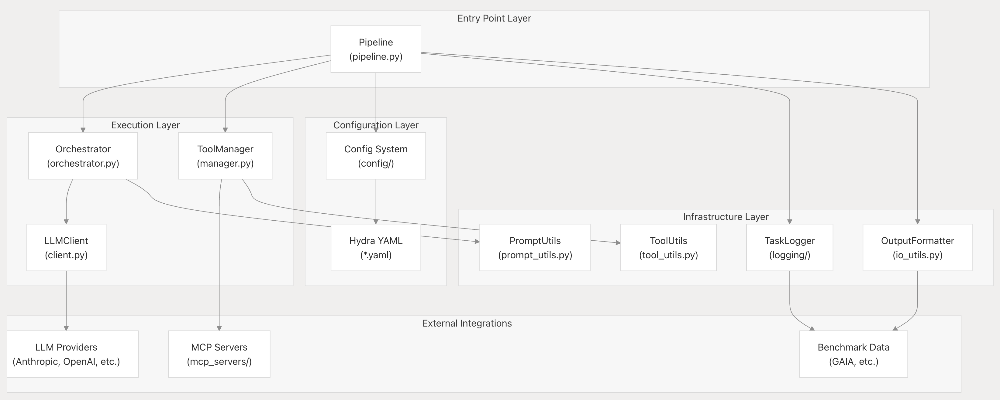

## Workflow Overview

MiroFlow handles user queries through a multi-stage and agentic process designed for flexibility and depth. The workflow is organized as follows:

1. **Intent Recognition & Query Augmentation**  
   LLMs analyze user input to detect intent and refine the query.

2. **Planning & Task Orchestration**  
   The main agent drafts an execution plan, invokes tools, and coordinates sub-agents.

3. **Delegation to Sub-Agents**  
   Specialized agents (e.g., agent-browsing) handle complex or domain-specific tasks. Sub-agents independently plan, act, and execute tool calls as needed.

4. **Tool Access via MCP Servers**  
   When external capabilities are required, agents leverage specialized tools by connecting to MCP (Model Context Protocol) servers.

5. **Result Synthesis & Output Alignment**  
   After task completion, a dedicated summary process synthesizes results, ensuring the output is high-quality and aligned with user instructions (or benchmark formats).

## Architecture Components

All core components are located in the `MiroFlow/libs/` directory.

```
MiroFlow/libs/
├── miroflow/
│   └── src/miroflow/
│       ├── prebuilt/
│       │   ├── pipeline.py              # Pipeline: coordinates task execution
│       │   ├── orchestrator.py          # Orchestrator: manages LLM ↔ tool flow
│       │   └── config/                  # Hydra configs for agents, LLMs, pricing
│       ├── llm/
│       │   └── client.py                # Unified LLM client
│       ├── utils/
│       │   ├── io_utils.py              # Output formatting utilities
│       │   ├── prompt_utils.py          # Prompt definitions for agents
│       │   └── tool_utils.py            # Tool configuration helpers
│       └── logging/                     # Task logging & metrics
│
├── miroflow-tool/
│   └── src/miroflow/tool/
│       ├── manager.py                   # Tool Manager: MCP server connector
│       └── mcp_servers/                 # Individual MCP tool servers
│           ├── python_server.py         # Code execution
│           ├── vision_mcp_server.py     # Visual perception
│           ├── searching_mcp_server.py  # Web search & retrieval
│           ├── audio_mcp_server.py      # Audio transcription
│           ├── reasoning_mcp_server.py  # Enhanced reasoning
│           └── reading_mcp_server.py    # Document processing
```



### Core System 💻

- **Pipeline** (`./miroflow/src/miroflow/prebuilt/pipeline.py`): Main entry point that creates and manages all components, handles error recovery, and returns final results

- **Orchestrator** (`./miroflow/src/miroflow/prebuilt/orchestrator.py`): Manages multi-turn conversations, parses tool calls, executes tools, and delegates to sub-agents

- **LLM Client** (`./miroflow/src/miroflow/llm/client.py`): Unified interface supporting Anthropic, OpenAI, Google, Qwen, DeepSeek, and local deployments

### Tool Integration 🔧

- **Tool Manager** (`./miroflow-tool/src/miroflow/tool/manager.py`) : Comprehensive MCP server connection manager with tool discovery, persistent connections, and error handling

- **MCP Servers** (`./miroflow-tool/src/miroflow/tool/mcp_servers/`) : Individual tool implementations built on FastMCP. Provides extensive capabilities including:
  - Code execution and analysis (`./python_server.py`)
  - Visual perception (`./vision_mcp_server.py`)
  - Web search and content retrieval (`./searching_mcp_server.py`)
  - Audio transcription (`./audio_mcp_server.py`)
  - Enhanced reasoning capabilities (`./reasoning_mcp_server.py`)
  - Document processing and analysis (`./reading_mcp_server.py`)

### Agent System 👷

**Sub-Agents**  
Specialized agents designed for specific domains (e.g., `agent-browsing` for web navigation). Each sub-agent maintains dedicated tool sets and custom prompts, allowing the main agent to delegate tasks requiring specialized expertise. Agent definitions are managed through configuration files with prompts and descriptions customized in `./miroflow/src/miroflow/utils/prompt_utils.py` and `tool_utils.py`.

### Support Systems ⚙️

- **Configuration System** (`./miroflow/src/miroflow/prebuilt/config/`) : Hydra-powered YAML configuration for agents, LLMs, benchmarks, and pricing

- **Output Formatter** (`./miroflow/src/miroflow/utils/io_utils.py`) : Intelligent response formatting that adapts to various benchmark requirements

- **Task Logger** (`./miroflow/src/miroflow/logging/`) : Comprehensive logging for agent interactions, tool executions, and performance metrics

### Execution Pipeline Data Flow

